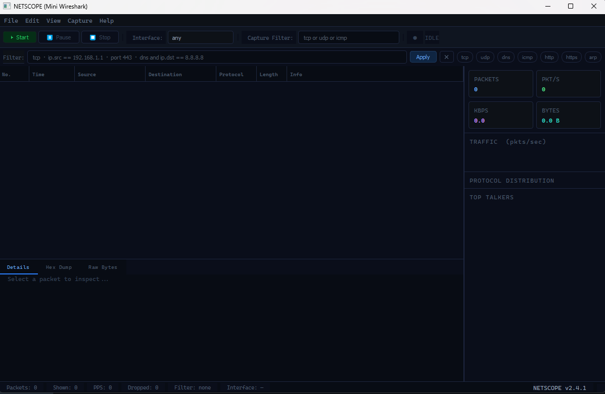
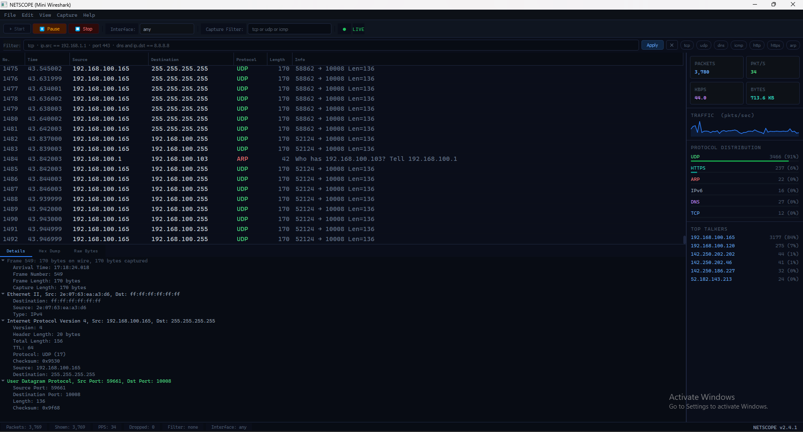
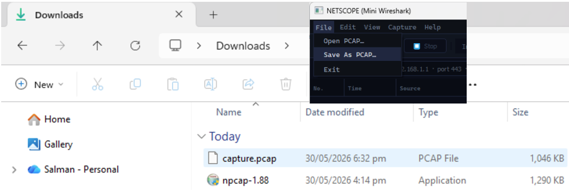
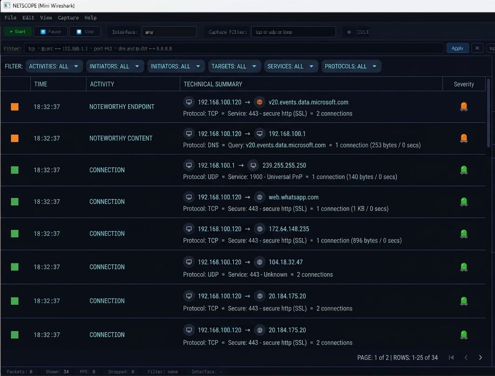

# 📡 NETSCOPE  ( Wireshark-like Network Packet Analyzer )

<d )iv align="center">


**A professional-grade network packet analyzer built with Python + PyQt5 + scapy.**
Captures, decodes, and visualizes live network traffic — just like Wireshark, but yours.

</div>

---

## ✨ Features

| Feature | Description |
|---------|-------------|
| 🔴 **Live Packet Capture** | Capture real-time traffic on any network interface |
| 🔬 **Protocol Parsing** | Full decode of Ethernet → IPv4 → TCP/UDP/ICMP → DNS/HTTP/ARP |
| 🖥️ **Wireshark-style GUI** | Dark themed PyQt5 interface with resizable panes |
| 🔍 **Display Filters** | `tcp`, `ip.src == 192.168.1.1`, `port 443`, `dns and not icmp` |
| 📊 **Live Statistics** | Protocol distribution bars, sparkline graph, top talkers |
| 🌳 **Protocol Tree** | Expandable layer-by-layer packet inspection |
| 🔢 **Hex Dump** | Raw bytes + ASCII representation per packet |
| 💾 **PCAP Export/Import** | Save captures, load existing `.pcap` files |
| ⌨️ **Keyboard Shortcuts** | `F5` Start · `F6` Stop · `Space` Pause |

---

## 📸 Interface Preview

```
┌─────────────────────────────────────────────────────────────────────────────┐
│ NETSCOPE  File  Edit  View  Capture  Analyze  Statistics  Help         LIVE●│
├─────────────────────────────────────────────────────────────────────────────┤
│ [▶ Start] [⏸ Pause] [⏹ Stop]   Interface: [eth0 ▼]   Filter: tcp or udp   │
├──────────────────────────────────────────────────────────────┬──────────────┤
│ Filter: [ip.src == 192.168.1.1 and port 443          ] Apply │  PACKETS     │
├────┬──────────┬──────────────┬──────────────┬───────┬───┬───┤  12,847      │
│ No │ Time     │ Source       │ Destination  │ Proto │Len│Info│             │
├────┼──────────┼──────────────┼──────────────┼───────┼───┼───┤  PKT/S       │
│  1 │ 0.000000 │ 192.168.1.5  │ 8.8.8.8      │ DNS   │ 78│...│  342         │
│  2 │ 0.001234 │ 8.8.8.8      │ 192.168.1.5  │ DNS   │122│...│             │
│  3 │ 0.002456 │ 192.168.1.5  │ 142.250.1.46 │ HTTPS │ 64│...│  TCP  ████  │
│  4 │ 0.003123 │ 142.250.1.46 │ 192.168.1.5  │ TCP   │ 64│...│  UDP  ██    │
├────┴──────────┴──────────────┴──────────────┴───────┴───┴───┤  DNS  █     │
│ ▼ Frame 3: 64 bytes                                          │  ICMP ▌     │
│   ▼ Ethernet II  Src: aa:bb:cc Dst: 11:22:33                 ├──────────────┤
│     ├ Destination: 11:22:33:44:55:66                         │ TOP TALKERS │
│     └ Source: aa:bb:cc:dd:ee:ff                              │ 192.168.1.5 │
│   ▼ Internet Protocol  Src: 192.168.1.5  Dst: 142.250.1.46  │ 8.8.8.8     │
│     ├ Version: 4  TTL: 64                                    └──────────────┘
│     └ Protocol: TCP (6)
│   ▼ TCP  Src: 54321  Dst: 443  [SYN-ACK]
└─────────────────────────────────────────────────────────────────────────────┘
```
### Main Dashboard ( Idle )

### Main Dashboard ( Live Capturing )

### Packet Capture data File 

### Statistics Panel

---

## 🚀 Quick Start

### Prerequisites

- Python 3.9+
- pip

### Installation

```bash
# 1. Clone the repo
git clone https://github.com/Salman-Sensei/packet-sniffer
cd packet-sniffer

# 2. Create a virtual environment (recommended)
python -m venv venv

# Linux/Mac
source venv/bin/activate

# Windows
venv\Scripts\activate

# 3. Install dependencies
pip install -r requirements.txt
```

### Running

```bash
# Linux / Mac : requires root for raw socket access
sudo python main.py

# Windows : run your Terminal as Administrator, then:
python main.py
```

> **Why root/admin?**
> Raw packet capture requires direct access to network interfaces,
> which is a privileged operation on all operating systems.

---

## 🐧 Linux  Grant Permissions Without sudo (Optional)

If you don't want to run the whole app as root:

```bash
# Grant raw socket capability to your Python binary
sudo setcap cap_net_raw,cap_net_admin=eip $(which python3)

# Now run normally
python main.py
```

---

## 🪟 Windows  Install Npcap

Windows requires **Npcap** for packet capture:

1. Download from [https://nmap.org/npcap/](https://nmap.org/npcap/)
2. Install with default options
3. Run Terminal as Administrator
4. `python main.py`

---

## 🔍 Filter Syntax Reference

NETSCOPE supports a Wireshark-inspired display filter syntax:

| Filter | What it does |
|--------|-------------|
| `tcp` | Show only TCP packets |
| `udp` | Show only UDP packets |
| `dns` | Show only DNS packets |
| `icmp` | Show only ICMP (ping) packets |
| `http` | Show only HTTP packets |
| `arp` | Show only ARP packets |
| `ip.src == 192.168.1.1` | Source IP equals |
| `ip.dst == 8.8.8.8` | Destination IP equals |
| `port 80` | Either port is 80 |
| `port == 443` | Either port is 443 |
| `tcp.port == 22` | TCP port is 22 (SSH) |
| `tcp and port 80` | TCP AND port 80 |
| `tcp or udp` | TCP OR UDP |
| `not icmp` | Everything except ICMP |
| `ip.src == 192.168.1.1 and port 443` | Combined filter |
| `dns and ip.dst == 8.8.8.8` | DNS queries to Google |

**Filter bar turns red** if the syntax is invalid. Hit `Enter` or click **Apply** to activate.

---

## ⌨️ Keyboard Shortcuts

| Key | Action |
|-----|--------|
| `F5` | Start capture |
| `F6` | Stop capture |
| `Space` | Pause / Resume |
| `Ctrl+S` | Save PCAP |
| `Ctrl+O` | Open PCAP |

---

## 📁 Project Structure

```
packet-sniffer/
├── main.py                        # Entry point
├── requirements.txt
├── README.md
│
├── src/
│   ├── capture/
│   │   ├── packet_capture.py      # CaptureThread + PacketCapture manager
│   │   └── statistics.py          # Live traffic statistics
│   │
│   ├── parse/
│   │   ├── parsed_packet.py       # ParsedPacket dataclass
│   │   ├── packet_parser.py       # Orchestrates all parsers
│   │   ├── ethernet.py            # Layer 2 — Ethernet
│   │   ├── ipv4.py                # Layer 3 — IPv4
│   │   ├── tcp.py                 # Layer 4 — TCP
│   │   └── protocols.py           # UDP, ICMP, DNS, ARP
│   │
│   ├── filter/
│   │   └── filter_engine.py       # Display filter parser + evaluator
│   │
│   ├── export/
│   │   └── pcap_export.py         # Save/load .pcap files
│   │
│   ├── gui/
│   │   ├── main_window.py         # Main QMainWindow
│   │   ├── packet_table.py        # Packet list (QTableView + model)
│   │   ├── packet_details.py      # Protocol tree + hex dump pane
│   │   ├── statistics_panel.py    # Right-side stats sidebar
│   │   └── filter_bar.py          # Filter input bar
│   │
│   └── utils/
│       ├── constants.py            # Protocol colors, column config
│       └── helpers.py              # MAC/IP formatting, hex dump, etc.
│
└── tests/
    ├── test_parsers.py             # Unit tests for all parsers
    └── test_capture.py             # Integration tests for PacketParser
```

---

## 🧪 Running Tests

```bash
# Install test dependencies (included in requirements.txt)
pip install pytest pytest-cov

# Run all tests
pytest tests/ -v

# Run with coverage report
pytest tests/ -v --cov=src --cov-report=term-missing

# Run specific test file
pytest tests/test_parsers.py -v
```

---

## 🏗️ Architecture

```
                    ┌─────────────────────────────┐
                    │         PyQt5 GUI            │
                    │  MainWindow                  │
                    │  ├── FilterBar               │
                    │  ├── PacketTableView         │
                    │  ├── PacketDetailsPane       │
                    │  └── StatisticsPanel         │
                    └──────────┬──────────────────-┘
                               │ signals/slots
                    ┌──────────┴──────────────────-┐
                    │      CaptureThread (QThread)  │
                    │  scapy.sniff() in background  │
                    └──────────┬───────────────────┘
                               │ raw scapy packet
                    ┌──────────┴───────────────────┐
                    │       PacketParser            │
                    │  EthernetParser               │
                    │  IPv4Parser                   │
                    │  TCPParser / UDPParser         │
                    │  ICMPParser / DNSParser        │
                    └──────────┬───────────────────┘
                               │ ParsedPacket
                    ┌──────────┴───────────────────┐
                    │     FilterEngine              │
                    │  Evaluates display filters    │
                    └──────────┬───────────────────┘
                               │ visible: bool
                    ┌──────────┴───────────────────┐
                    │  PacketTableModel             │
                    │  TrafficStatistics            │
                    └──────────────────────────────┘
```

---

## 🧱 Tech Stack

| Component | Technology |
|-----------|-----------|
| Language | Python 3.9+ |
| GUI Framework | PyQt5 5.15+ |
| Packet Capture | scapy 2.5+ |
| Protocol Parsing | struct module + custom parsers |
| PCAP Export | scapy wrpcap/rdpcap |
| Testing | pytest + pytest-cov |

---

## 🔮 Planned Features (v3.0)

- [ ] Follow TCP Stream (reassemble full HTTP conversations)
- [ ] ML-based anomaly detection (port scans, DDoS patterns)
- [ ] IPv6 full support
- [ ] React/FastAPI web frontend alternative
- [ ] GeoIP lookup for source/destination IPs
- [ ] Packet search by content
- [ ] Custom color rules
- [ ] Export to CSV / JSON

---

## ⚠️ Disclaimer

NETSCOPE is intended for **educational and legitimate network debugging purposes only**.
Only capture traffic on networks you own or have explicit permission to monitor.
Unauthorized packet capture may be illegal in your jurisdiction.

---

## 📄 License

MIT License  see [LICENSE](LICENSE) for details.

---

## 🙏 Acknowledgments

- Inspired by [Wireshark](https://www.wireshark.org/)  the gold standard
- Packet capture powered by [scapy](https://scapy.net/)
- GUI built with [PyQt5](https://www.riverbankcomputing.com/software/pyqt/)

---

<div align="center">
Built with ❤️ by <strong>Salman-Khan</strong>
</div>
